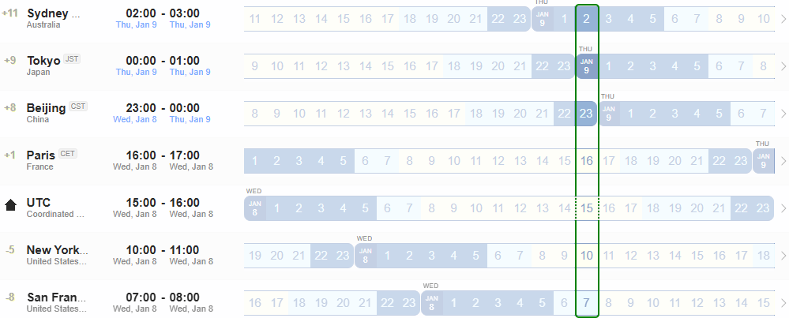

## NASR Interim - [8 January UTC 15:00](https://www.worldtimebuddy.com/?qm=1&lid=100,5391959,5128581,2988507,1816670,1850147&h=100&date=2025-1-8&sln=15-16&hf=1)
- Calendar Invitation & Conference Link: **[.ics file](./Material/NASR-08012025.ics)** 

    - **Note: For some time zones it will be very early Thursday morning (9 January 2025)** 
    

### Agenda

1. Nancy & Luigi: Meeting opening
    - Any Comment on last meeting minutes?
2. Overview existing Pull Requests on Charter: All
    - https://github.com/ietf-nasr/NASR-Charter
3. New Name for the group: All

**[Postponed due to lack of time]**

4. NASR Service Model: Meiling Chen
5. RATS Conceptual Message Wrappers (CMW) in NASR: Henk Birkholz

### Materials

- [Chairs' Slides](./Material/NASR-Interim-Meeting-08-01-2025-v2.pdf)
- [GitHub Charter Repository](https://github.com/ietf-nasr/NASR-Charter)
- [GitHub BOF Request Repository](https://github.com/ietf-nasr/bof-request-IETF-122)

### Minutes

- [Minutes NASR Meeting 08 January 2025](./Material/NASR-Minutes-080125.md)

### Recordings

- [Chat Recording](./Material/GMT20250108-145323_RecordingnewChat.txt)
- [Audio Transcript](./Material/GMT20250108-145323_Recording.transcript.vtt) 

