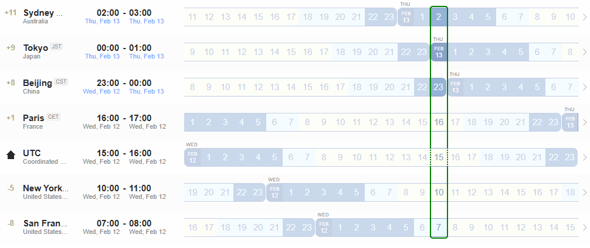

## NASR Interim - [12 February 2025 UTC 15:00](https://www.worldtimebuddy.com/?qm=1&lid=2147714,1850147,1816670,2988507,100,5128581,5391959&h=100&date=2025-2-12&sln=15-16&hf=0)

- Calendar Invitation & Conference Link: **[.ics file](./Material/NASR-12022025.ics)**

- **Note: For some time zones it will be very early Thursday morning (13 February 2025)** 
        

### Agenda

1. Nancy & Luigi: Meeting opening
    - Any Comment on last meeting minutes?

2. Review Slides
    - Slides are available on a **[shared Google Docs folder](https://drive.google.com/drive/folders/1IZrVA9WWIdra-pZ9mY3uJW0mADzTUxf4?usp=sharing
)** 

### Materials

- [Proposed BoF Chairs' Slides](./Material/NASR-IETF-122-Chairs.pptx)
- [Proposed BoF Problem Statement Slides](./Material/NASR-IETF-122-Problem-Statement.pptx)

### Minutes

- [Minutes NASR Meeting 12 February 2025](./Material/NASR-Minutes-12022025.md)

### Recordings

- [Chat Recording](./Material/GMT20250212-034858_RecordingwChat.txt)
- [Audio Transcript](./Material/GMT20250212-034858_Recording.transcript.txt)