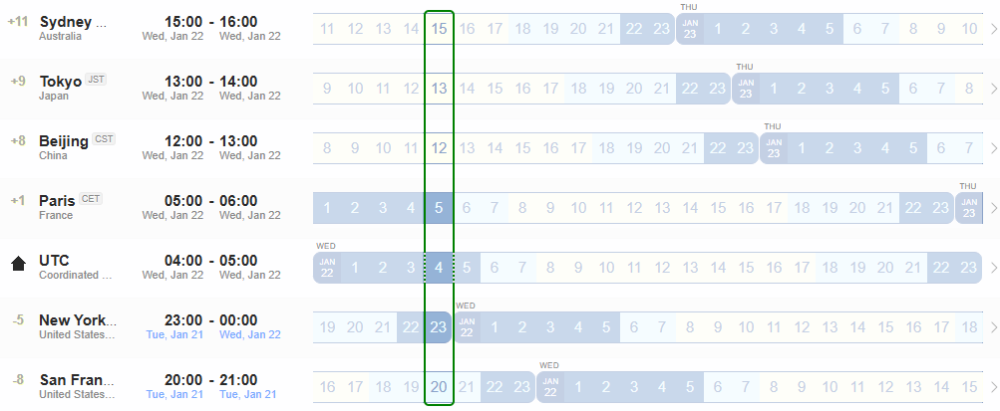

## NASR Interim - [22 January 2025 UTC 04:00](https://www.worldtimebuddy.com/?qm=1&lid=2147714,1850147,1816670,2988507,100,5128581,5391959&h=100&date=2025-2-12&sln=15-16&hf=0) 

- Calendar Invitation & Conference Link: **[.ics file](./Material/NASR-22012025.ics)**
    - **Note: For some time zones it will be Tuesday evening (21 January 2025)** 
        

### Agenda

1. Nancy & Luigi: Meeting opening
    - Any Comment on last meeting minutes?

2. Discussion on official BoF Agenda 
    - Focus on the technical part
    - Agenda proposed in the BoF request:
        - Note Well and Agenda Bashing - Chairs
            - Why are we here? - Chairs
            - Summary feedback previous BoF and how concerns have been addressed
        - Internet-Drafts, speakers, timing
            - TBD **(FOCUS of the meeting)**
        - Open Mic Discussion
            - Feedback from the community
        - Explore consensus and next steps

### Materials

- [Chairs' Slides](./Material/NASR-Interim-Meeting-22-01-2025-v0.pdf)

### Minutes

- [Minutes NASR Meeting 22 January 2025](./Material/NASR-Minutes-22012025.md)

### Recordings

- [Chat Recording](./Material/GMT20250122-034858_RecordingnewChat.txt)
- [Audio Transcript](./Material/GMT20250122-034858_Recording.transcript.vtt)