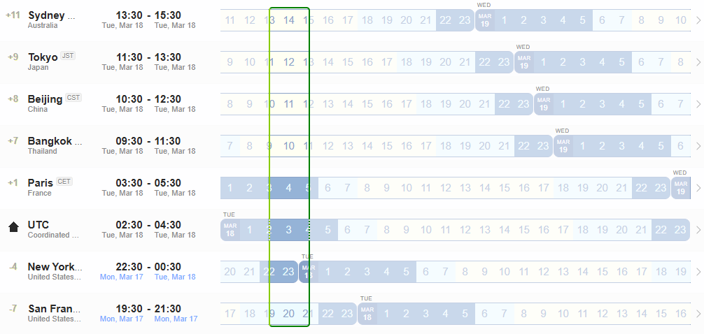

# NASR Meetings

This repository contains material and pointers to past and future NASR meetings.

## Next Upcoming Meeting:

# NASR is meeting at next **[IETF 122 in Bangkok](https://datatracker.ietf.org/meeting/122/agenda)** - [18 March 2025 UTC 02:30](https://www.worldtimebuddy.com/?qm=1&lid=1850147,1816670,1609350,2988507,100,5128581,5391959&h=100&date=2025-3-18&sln=2.5-4.5&hf=1) 

- Calendar Invitation: **[.ics file](https://datatracker.ietf.org/meeting/122/session/34026.ics)** 

    - **Note: For some time zones it will be Monday evening (17 March 2025)**
        
        

- **[Meeting Agenda, Materials, and Minutes](https://datatracker.ietf.org/meeting/122/session/nasr)**

 

---

### Past Meetings

#### NASR Interim Meeting - [26 February 2025 UTC 04:00](https://www.worldtimebuddy.com/?qm=1&lid=100,5391959,5128581,2988507,1816670,1850147&h=100&date=2025-2-26&sln=4-5&hf=1) 

- [Meeting Agenda, Materials, and Minutes](./NASR-Interim-26-Feb-2025/README.md)

#### NASR Interim Meeting - [12 February 2025 UTC 15:00](https://www.worldtimebuddy.com/?qm=1&lid=2147714,1850147,1816670,2988507,100,5128581,5391959&h=100&date=2025-2-12&sln=15-16&hf=0)

- [Meeting Agenda, Materials, and Minutes](./NASR-Interim-12-Feb-2025/README.md)

#### NASR Interim Meeting - [22 January 2025 UTC 04:00](https://www.worldtimebuddy.com/?qm=1&lid=100,5391959,5128581,2988507,1816670,1850147&h=100&date=2025-1-22&sln=4-5&hf=1) 

- [Meeting Agenda, Materials, and Minutes](./NASR-Interim-22-Jan-2025/README.md)

#### NASR Interim Meeting - [8 January 2025 UTC 15:00](https://www.worldtimebuddy.com/?qm=1&lid=100,5391959,5128581,2988507,1816670,1850147&h=100&date=2025-1-8&sln=15-16&hf=1)

- [Meeting Agenda, Materials, and Minutes](./NASR-Interim-08-Jan-2025/README.md)

#### NASR Interim Meeting - [11 December 2024 UTC 04:00](https://www.worldtimebuddy.com/?qm=1&lid=100,5391959,5128581,2988507,1816670,1850147&h=100&date=2024-12-11&sln=4-5&hf=1)
  
- [Meeting Agenda, Materials, and Minutes](./NASR-Interim-11-Dec-2024/README.md)

#### NASR Interim Meeting - 27 November 2024

- [Meeting Agenda, Materials, and Minutes](./NASR-Interim-27-Nov-2024/README.md)

#### NASR Side Meeting @ IETF 121

- [Meeting Agenda, Materials, and Minutes](./IETF-121-Side-Meeting/README.md)

#### NASR Non WG Forming BoF @ IETF 120

- [Meeting Agenda, Materials, and Minutes](https://datatracker.ietf.org/meeting/120/session/nasr)

#### NASR Side Meeting @ IETF 119 

-  **[Meeting Agenda, Materials, and Minutes](https://github.com/liuchunchi/nasr_side_meeting)**

#### NASR Side Meeting @ IETF 118

-  **[Meeting Agenda, Materials, and Minutes](https://github.com/liuchunchi/nasr_side_meeting/tree/main/IETF%20118%20Path%20Validation%20Side%20Meeting%20Archive)**